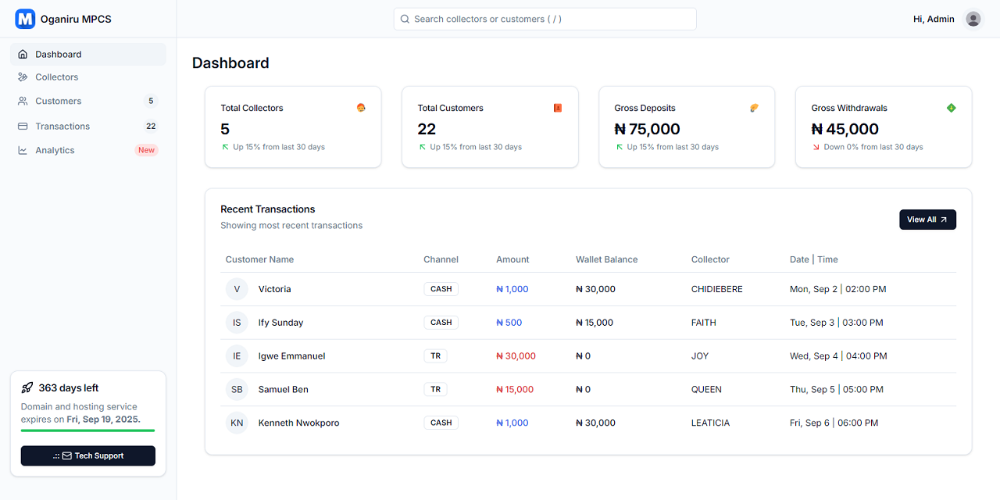

# Marina CMS

Reusable Admin Dashboard - Remix + Shadcn/ui

[](https://remix.run/docs/en/main/start/tutorial)
[](https://www.typescriptlang.org/docs/)
[](https://www.postgresql.org/docs/16/index.html)

[](https://marina-cms.vercel.app)

## Setup

```bash
$ git clone https://github.com/2gbeh/marina-cms.git

$ cd marina-cms

$ npm install

$ npm run dev
```

## Usage

> Local: http://localhost:5173

## Debug

```bash
$ nvm use 20.17.0

$ npm cache clean --force

$ rm -rf node_modules package-lock.json

$ npm install
```

## Deploy

```bash
$ npm run build

$ npm start
```

If you're familiar with deploying Node applications, the built-in Remix app server is production-ready.

Make sure to deploy the output of `npm run build`

- `build/server`
- `build/client`

## Screenshot



## Resources

#### [Remix Flat Routes](https://github.com/kiliman/remix-flat-routes)

> ./app/routes-hybrid-files/

```
├── _auth+
│   ├── forgot-password.tsx
│   └── login.tsx
├── _public+
│   ├── _layout.tsx
│   ├── about.tsx
│   ├── contact[.jpg].tsx
│   └── index.tsx
├── project+
│   ├── _layout.tsx
│   ├── parent.child
│   │   └── index.tsx
│   └── parent.child.grandchild
│       ├── index.tsx
│       └── styles.css
└── users+
    ├── $userId.tsx
    ├── $userId_.edit.tsx
    ├── _layout.tsx
    └── index.tsx
```

#### [JSON Server](https://www.freecodecamp.org/news/json-server-for-frontend-development/)

```bash
$ npm install -g json-server
$ json-server --watch ./app/data/posts.json --port=8000
```
