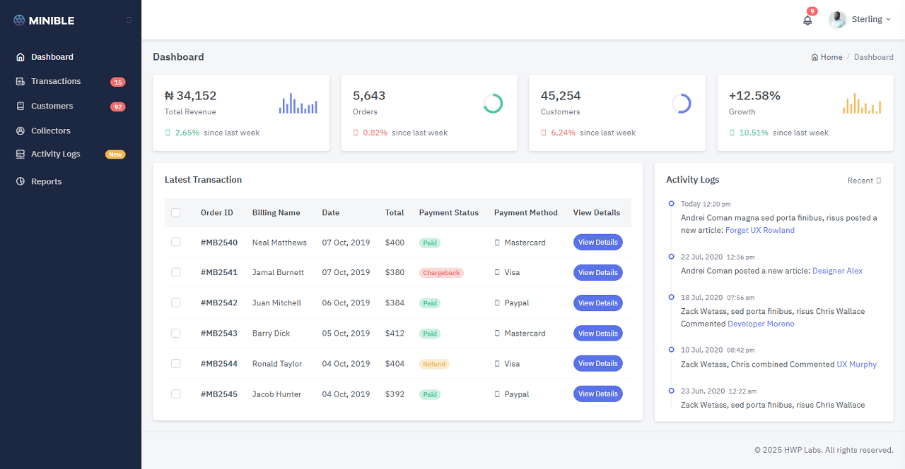

# Marina CMS

Reusable Admin Dashboard - Next.js 14 + Shadcn/ui

[](https://nextjs.org/docs)
[](https://www.typescriptlang.org/docs/)
[](https://www.postgresql.org/docs/16/index.html)
[](https://supabase.com/docs/guides/getting-started/quickstarts/nextjs)

[](https://marina-cms.vercel.app)

## Installation

```
$ git clone https://github.com/2gbeh/marina-cms.git

$ cd marina-cms

$ npm install

$ npm run dev
```

## Usage

> Local:   http://localhost:3000/

## Documentation


